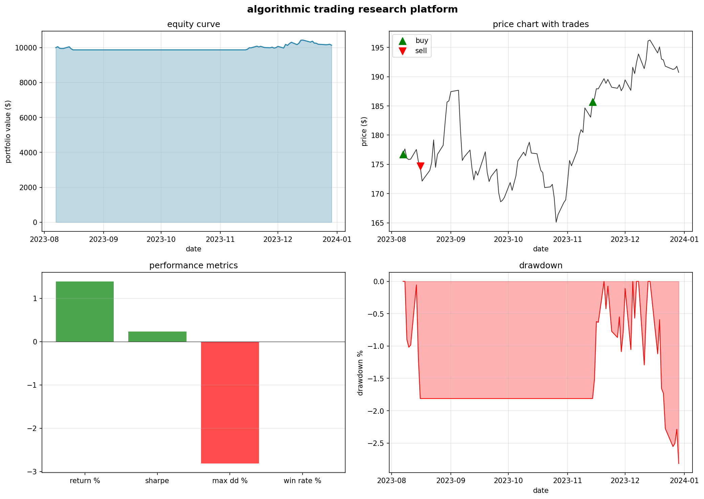
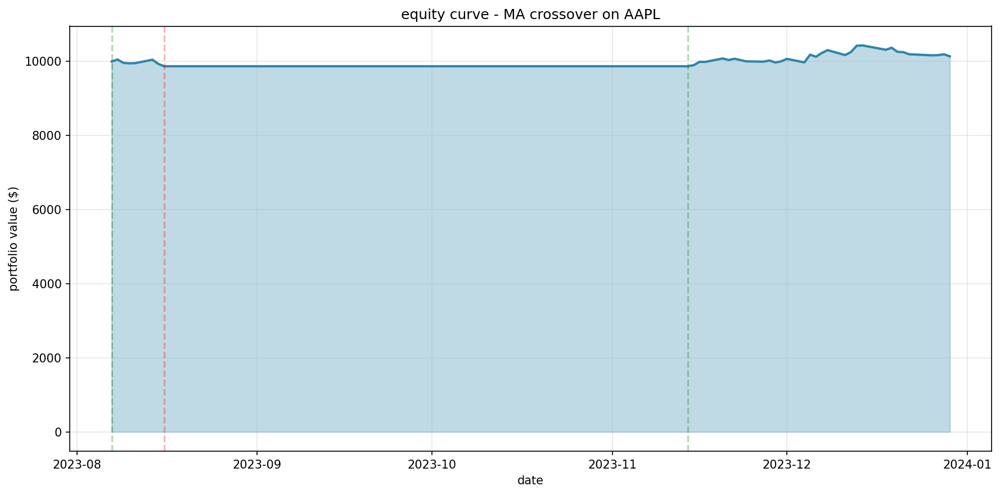

# Algorithmic Trading Research

A backtesting system for testing trading strategies against historical market data with statistical validation.



---

## Table of Contents

- [Overview](#overview)
- [Features](#features)
- [Installation](#installation)
- [Usage](#usage)
- [Strategies](#strategies)
- [Statistical Analysis](#statistical-analysis)
- [Project Structure](#project-structure)
- [Tech Stack](#tech-stack)

---

## Overview

This project tests whether trading strategies actually outperform random chance. It combines backtesting with statistical significance testing to separate real edges from noise.

**Core workflow:**
1. Fetch historical price data
2. Generate buy/sell signals using a strategy
3. Simulate trades with transaction costs
4. Evaluate performance with statistical tests

---

## Features

| Feature | Description |
|---------|-------------|
| Multiple Strategies | MA Crossover, RSI, Momentum, Pairs Trading, Bollinger Bands |
| Train/Test Split | Validates strategies on unseen data |
| Statistical Testing | Bootstrap CI, permutation tests, Monte Carlo simulation |
| Benchmark Comparison | Compare against buy-and-hold baseline |
| Interactive Dashboard | Streamlit UI for parameter tuning |
| Cost Modeling | Commission and slippage simulation |

---

## Installation

```bash
git clone https://github.com/yourusername/algorithmic-trading-research.git
cd algorithmic-trading-research
pip install -r requirements.txt
```

---

## Usage

**Command Line:**
```bash
python main.py
```

**Dashboard:**
```bash
streamlit run app.py
```



---

## Strategies

| Strategy | Type | Logic |
|----------|------|-------|
| **MA Crossover** | Trend-following | Buy when short MA > long MA |
| **RSI** | Mean reversion | Buy oversold, sell overbought |
| **Momentum** | Trend-following | Trade in direction of recent returns |
| **Pairs Trading** | Statistical arbitrage | Mean reversion on z-score spread |
| **Bollinger Bands** | Mean reversion | Buy at lower band, sell at mean |

---

## Statistical Analysis

Every backtest runs three significance tests:

| Test | Question |
|------|----------|
| **Sharpe CI** | Is the Sharpe ratio significantly different from zero? |
| **Permutation Test** | Does it beat buy-and-hold? |
| **Monte Carlo** | Does it beat random entry/exit? |

**Interpretation:**
- 3/3 pass → Strong evidence of edge
- 2/3 pass → Needs more investigation
- 0-1/3 pass → Likely noise

---

## Project Structure

```
├── app.py                  # Streamlit dashboard
├── main.py                 # CLI entry point
├── requirements.txt
│
├── strategies/
│   ├── base.py             # Abstract strategy class
│   ├── moving_average.py
│   ├── rsi.py
│   ├── momentum.py
│   └── pairs_trading.py
│
├── backtest/
│   ├── engine.py           # Core simulation logic
│   └── costs.py            # Transaction cost model
│
├── analytics/
│   ├── metrics.py          # Performance metrics
│   └── significance.py     # Statistical tests
│
└── data/
    ├── fetcher.py          # Yahoo Finance API
    └── database.py         # SQLite storage
```

---

## Tech Stack

| Component | Technology |
|-----------|------------|
| Language | Python |
| Data | pandas, numpy |
| Statistics | scipy |
| Market Data | yfinance |
| Dashboard | Streamlit |
| Visualization | Plotly |

---

## License

MIT
