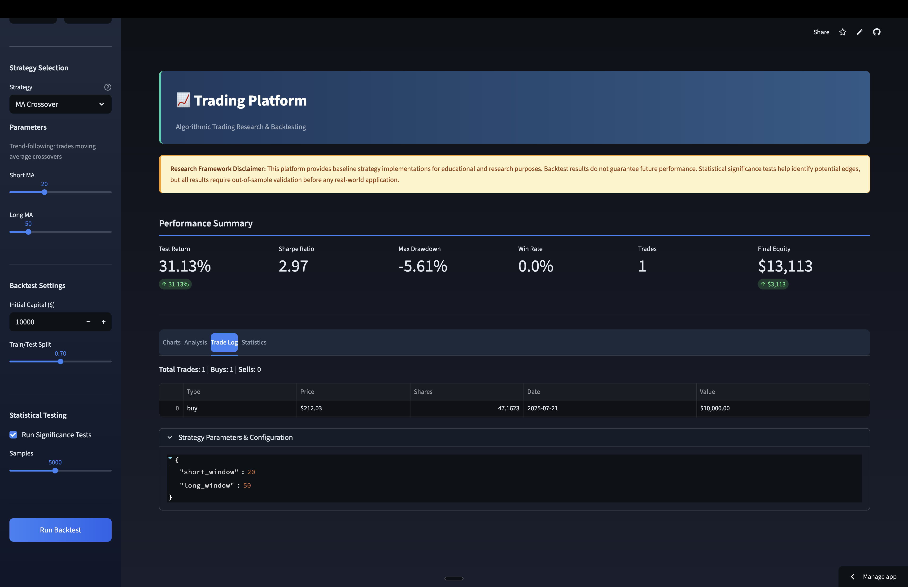
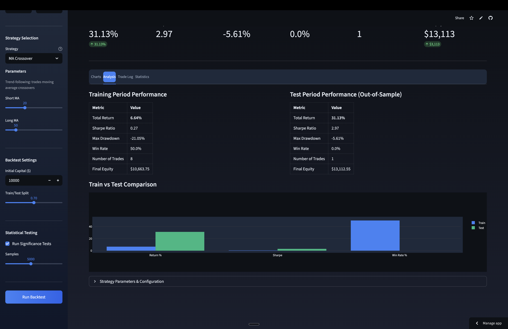
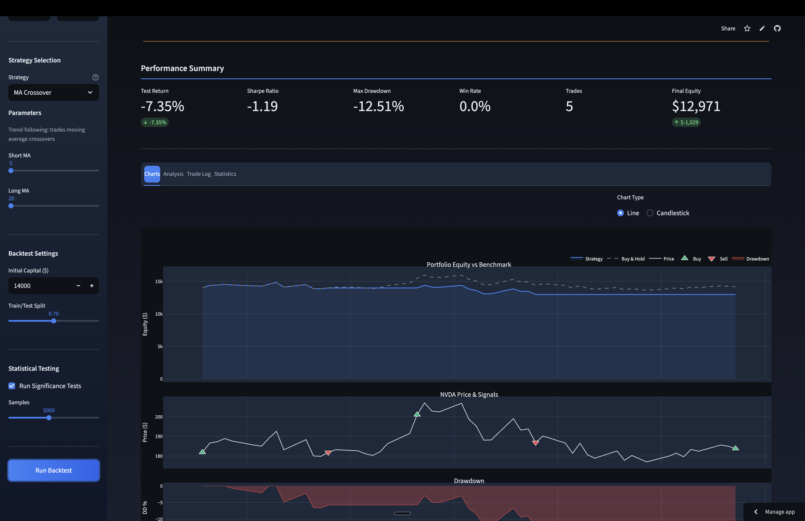
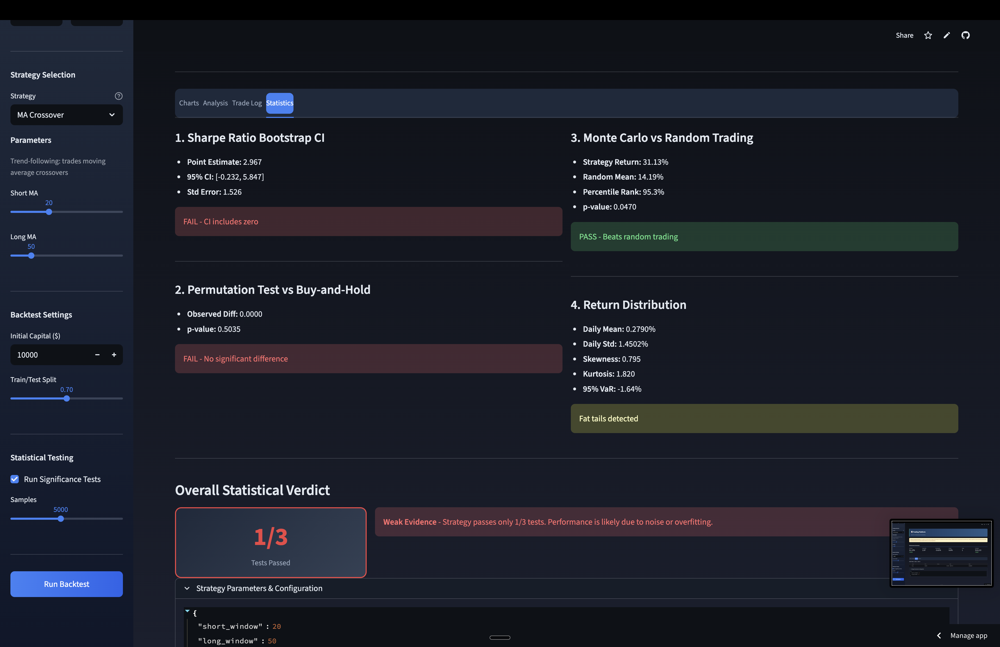

# Trading Strategy Validation     

A professional backtesting system for testing trading strategies against historical market data with statistical validation.



---

## Table of Contents

- [Overview](#overview)
- [Features](#features)
- [Installation](#installation)
- [Usage](#usage)
- [Strategies](#strategies)
- [Statistical Analysis](#statistical-analysis)
- [Project Structure](#project-structure)
- [Testing](#testing)
- [Contributing](#contributing)
- [License](#license)

---

## Overview

This project tests whether trading strategies actually outperform random chance. It combines backtesting with statistical significance testing to separate real edges from noise.

**Core workflow:**

1. Fetch historical price data
2. Generate buy/sell signals using a strategy
3. Simulate trades with transaction costs
4. Evaluate performance with statistical tests

---

## Features

| Feature               | Description                                                 |
| --------------------- | ----------------------------------------------------------- |
| Multiple Strategies   | MA Crossover, RSI, Momentum, Pairs Trading, Bollinger Bands |
| Strategy Templates    | Pre-configured settings with educational explanations       |
| Train/Test Split      | Validates strategies on unseen data                         |
| Statistical Testing   | Bootstrap CI, permutation tests, Monte Carlo simulation     |
| Benchmark Comparison  | Compare against buy-and-hold baseline                       |
| Interactive Dashboard | Professional Streamlit UI with dark theme                   |
| Cost Modeling         | Commission and slippage simulation                          |
| Candlestick Charts    | Toggle between line and OHLC candlestick views              |



---

## Installation

**Requirements:** Python 3.9+

```bash
# Clone the repository
git clone https://github.com/Hussain0327/algorithmic-trading-research.git
cd algorithmic-trading-research

# Create and activate a virtual environment (recommended)
python3 -m venv venv
source venv/bin/activate  # On Windows: venv\Scripts\activate

# Install dependencies
pip install -r requirements.txt
```

> **Note:** If you get `ModuleNotFoundError`, make sure you've activated your virtual environment and run `pip install -r requirements.txt`.

---

## Usage

**Dashboard (Recommended):**

```bash
streamlit run app.py
```



**Command Line:**

```bash
python main.py
```

---

## Strategies

Each strategy includes built-in documentation and recommended parameters:

| Strategy            | Type                  | Logic                                | Best For                    |
| ------------------- | --------------------- | ------------------------------------ | --------------------------- |
| **MA Crossover**    | Trend-following       | Buy when short MA > long MA          | Trending markets            |
| **RSI**             | Mean reversion        | Buy oversold, sell overbought        | Range-bound markets         |
| **Momentum**        | Trend-following       | Trade in direction of recent returns | Strong trending stocks      |
| **Pairs Trading**   | Statistical arbitrage | Mean reversion on z-score spread     | Correlated assets           |
| **Bollinger Bands** | Mean reversion        | Buy at lower band, sell at mean      | Volatility trading          |

---

## Statistical Analysis

Every backtest runs three significance tests:

| Test                 | Question                                               |
| -------------------- | ------------------------------------------------------ |
| **Sharpe CI**        | Is the Sharpe ratio significantly different from zero? |
| **Permutation Test** | Does it beat buy-and-hold?                             |
| **Monte Carlo**      | Does it beat random entry/exit?                        |

**Interpretation:**

- 3/3 pass → Strong evidence of edge
- 2/3 pass → Needs more investigation
- 0-1/3 pass → Likely noise



---

## Project Structure

```
├── app.py                  # Streamlit dashboard
├── main.py                 # CLI entry point
├── requirements.txt        # Pinned dependencies
│
├── strategies/
│   ├── base.py             # Abstract strategy class
│   ├── moving_average.py   # MA Crossover strategy
│   ├── rsi.py              # RSI strategy
│   ├── momentum.py         # Momentum strategy
│   └── pairs_trading.py    # Pairs Trading & Bollinger Bands
│
├── backtest/
│   ├── engine.py           # Core simulation logic
│   └── costs.py            # Transaction cost model
│
├── analytics/
│   ├── metrics.py          # Performance metrics (Sharpe, drawdown, etc.)
│   └── significance.py     # Statistical significance tests
│
├── data/
│   ├── fetcher.py          # Yahoo Finance API wrapper
│   └── database.py         # SQLite caching
│
├── tests/                  # Unit tests
│   ├── test_strategies.py
│   ├── test_engine.py
│   ├── test_metrics.py
│   └── test_significance.py
│
└── .streamlit/
    └── config.toml         # Dashboard theme configuration
```

---

## Testing

Run the test suite:

```bash
# Run all tests
pytest

# Run with coverage
pytest --cov=. --cov-report=html

# Run specific test file
pytest tests/test_strategies.py -v
```

---

## Contributing

Contributions are welcome! Please see [CONTRIBUTING.md](CONTRIBUTING.md) for guidelines.

---

## Tech Stack

| Component     | Technology    |
| ------------- | ------------- |
| Language      | Python 3.9+   |
| Data          | pandas, numpy |
| Statistics    | scipy         |
| Market Data   | yfinance      |
| Dashboard     | Streamlit     |
| Visualization | Plotly        |
| Testing       | pytest        |

---

## License

MIT
